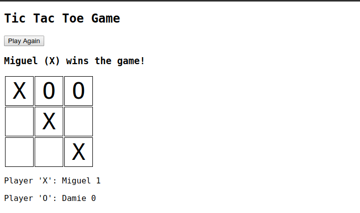

# Tic Tac Toe Project - [Microverse - JavaScript Course]

> ​ We’re making a Tic Tac Toe game you can play in your browser!.



Additional description about the project and its features.

## Link to Project
[OdinProject](https://www.theodinproject.com/courses/javascript/lessons/tic-tac-toe-javascript)

## Built With

- HTML/CSS
- Javascript

## Live Demo

[Live Demo Link](https://rawcdn.githack.com/damiecode/Tic-Tac-Toe-Js/ae91a6112a67103254fe556cf2b11d5712f1b1b1/index.html )


## Getting Started

To get a local copy up and running follow these simple example steps.

### Setup

Open your git bash and cd to the location you'd like to put your files the run the command below.

```console
git clone https://github.com/damiecode/Tic-Tac-Toe-Js.git
```

## Authors

👤 **Miguel Prada**

- Github: [@mapra99](https://github.com/mapra99)

👤 **Damilola Ale**

- Email: _codenlyn@gmail.com_
- Github: [@damiecode](https://github.com/damiecode)
- Twitter: [@iamlildamski](https://twitter.com/iamlildamski)

## Show your support

Give a ⭐️ if you like this project!
